<!-- _class: lead -->

# GitHub ActionsからGoogle API連携したい人のためのWorkload Identify解説


<!-- _paginate: false -->

------

# 目次
1. [案件情報](#3)
2. [背景](#8)
1. （蛇足）[VSレガシーOAth2.0認証 戦いの記録](#11)
3. [Workload Identity にわか解説](#29)
4. [GitHub ActionsのWorkload Identify移行](#36)
5. [感想](#60)
6. [参考ドキュメント](#61)


---

# ℹ️ 案件情報

* PyQの企業向けヘルプセンター（Q&A）
* **GitHub Actionsで、Google Spreadsheetから質問/回答を取得**
* .rstに変換
* sphinxでビルド

---

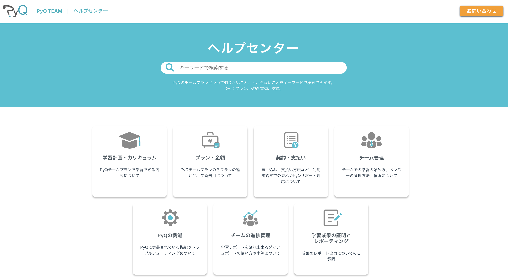

---

## ⚙️ 構成

---

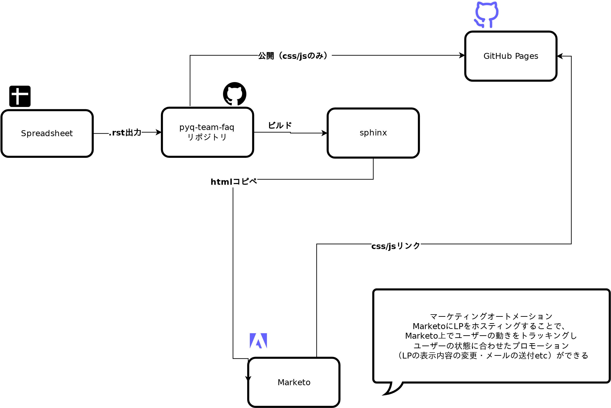

---

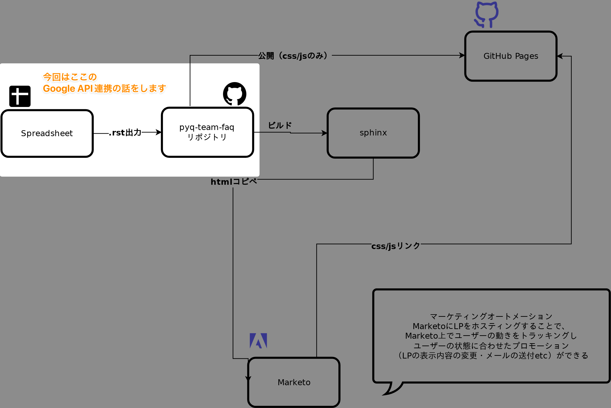

---

# 🏕️ 背景

* マーケチームがFAQの内容を管理
* 簡単に更新できるよう、SpreadSheet連携を当時のシステムチーム(🍣)が実装してくれた
* 初期は内容を変更していたが、ある程度の段階から更新がほぼ必要なくなった
  * 当初の目的は問い合わせを減らすこと
  * よくある問い合わせを網羅した結果、目的を達成

---

## 🏕️ 背景-つづき

* 他のチャネル施策に追われて放置…（2年ぐらい...）
* 今日話す内容とは別の事情※でsphinxのバージョンアップすらできないことが判明
  * ※昔の🍊のやらかし（sphinxのカスタムインデックスを魔改造して地獄を見た話）はまた別途💀
* そろそろやばいな…なんとかするか…

---

## そうして重い腰を上げたものの

* あらゆる仕様がレガシーになっていて認証が全然動かない
* 😇
* というわけで…

---

# 🆚 レガシーOAth2.0認証 戦いの記録 🐞🐛🐝 💥🔨 🍊

---

* 最終的にはほぼ使わなかったのですが供養しておきます👻
* 2年ほど動かしてなかったGoogle APIのOAth認証をアップデートする場合（ニッチすぎる）は使えるかも

---

## 🐞 discovery_cache is unavailable

```
googleapiclient.discovery_cache file_cache is unavailable when using oauth2client >= 4.0.0 or google-auth
```

- oath2clientの4.0.0以降でdiscovery_casheが非推奨になったらしい
- 設定してないけど…🤔❓️

---

明示的にFalseを指定する必要があるっぽい

```diff
-  service = build('sheets', 'v4', credentials=creds)
-  service_drive = build('drive', 'v3', credentials=creds)
+  service = build('sheets', 'v4', credentials=creds, cache_discovery=False)
+  service_drive = build('drive', 'v3', credentials=creds,  cache_discovery=False)
```

<br>

**解決**　🐞💥🔨

---

## 🐛 更新トークンが機能していない

```
google.auth.exceptions.RefreshError: ('invalid_grant: Bad Request', {'error': 'invalid_grant', 'error_description': 'Bad Request'})
```

https://developers.google.com/identity/protocols/oauth2?hl=ja#expiration

> Oath2.0の更新トークンが6ヶ月仕様されていない


まあこれですね…

---

* 最終更新が昔すぎてGCPの権限情報が行方不明…
* 下手したら退職した人しか持ってないかも…
* プロジェクトを作り直して **とりあえず動いた**　🐛💥🔨

---
## 🐝 OOBフローの非推奨・サポート切れ

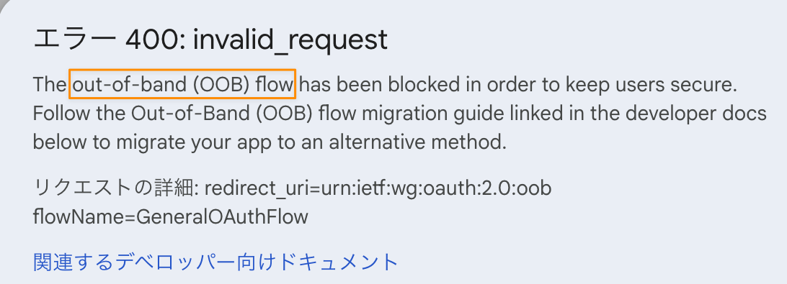

…なにそれ 🤔❓️

---
## ❔️OOBフロー？

> OAuth の 帯域外（OOB）（手動コピー/貼り付けオプションとも呼ばれます）は、ユーザーが OAuth 同意リクエストを承認した後に認証情報を受け入れるリダイレクト URI を持たないネイティブ クライアントをサポートするために開発されたレガシーフローです。OOB フローはリモート フィッシングのリスクをもたらすため、クライアントはこの脆弱性から保護するために別の方法に移行する必要があります。

要するにURLから認証画面に遷移するフローはセキュリティ❌️だからだめだよとなったらしい

---

> 主なコンプライアンス期間
>  * 2022 年 2 月 28 日 - OOB フローでの新しい OAuth の使用のブロック
>  * 2022 年 9 月 5 日 - ポリシーに準拠していない OAuth リクエストに対して、ユーザー向けの警告メッセージが表示される場合がある
> * 2022 年 10 月 3 日 - 2022 年 2 月 28 日より前に作成された OAuth クライアントに対する OOB フローのサポートを終了
> * 2023 年 1 月 31 日 - 既存のすべてのクライアントがブロックされる（除外されたクライアントを含む）

<br>
* 🍊.o(最後の更新、2022年の2月だな…）

---

* 今のコード見てみた
* `creds = flow.run_console()`
* 🍊.o(めちゃめちゃコンソール開いてるな…）

---

## 🏃 [クイックスタート](https://developers.google.com/sheets/api/quickstart/python)を読んで愚直に置き換えてみる

---

### 1️⃣ OAth同意画面作成
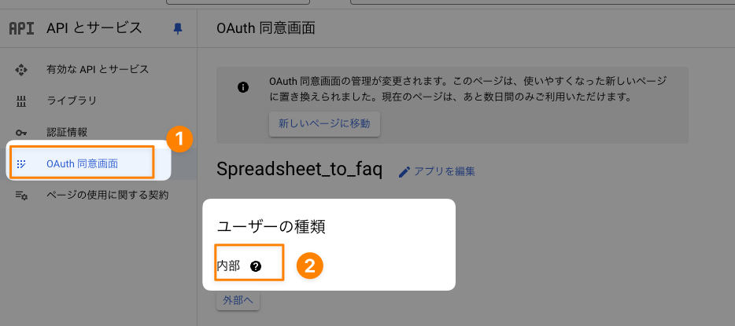

---

### 2️⃣ クライアントID作成
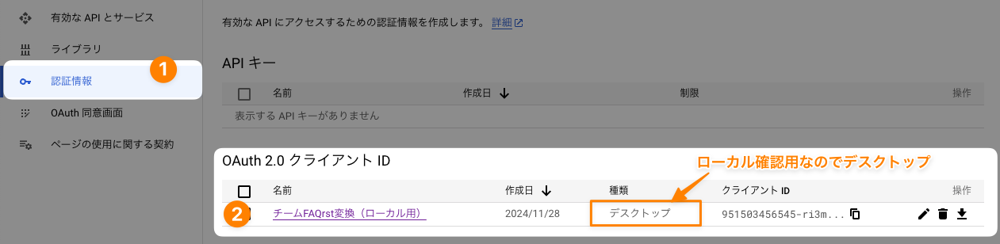

---

### 3️⃣ 認証スクリプト書き換え

```diff
def main_authz(args) -> int:
    """The main function of `authz` sub-command"""
    flow = InstalledAppFlow.from_client_secrets_file(
        args.credentials_json,
        SCOPES,
    )
-    creds = flow.run_console()
+    creds = flow.run_local_server()
    args.token_file.write(creds.to_json())
    return 0
```

---

## なんとかなれーーッ!!


---

## なんとかなっ（=ローカルで動い）た 


---

## このままwebクライアントに置き換えてもいいんだけれども…

* デスクトップとwebクライアントで同意画面・クライアントIDの設定が異なる
* ということは、GitHub Actionsと手元確認用に、2種類の認証情報を用意する必要がある？
* スクリプトも結局かわる？
* **…なんか移行までに考えることが多くて~~面倒だな~~…**

---

~~めんどくさく~~つらい気持ちになっていたらGoogle API認証顧問🍺から有益情報

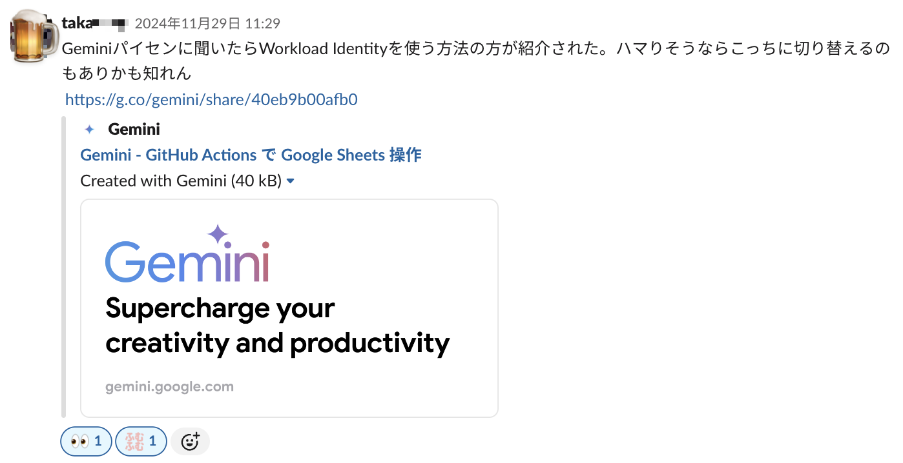

---

# 💁 Workload Identity にわか解説

---

## 概要

> Workload Identity 連携を使用すると、サービス アカウント キーの代わりにフェデレーション ID を使用して、オンプレミスまたはマルチクラウドのワークロードに Google Cloud リソースへのアクセス権を付与できます。

[Workload Identity 連携](https://cloud.google.com/iam/docs/workload-identity-federation?hl=ja)


> Workload Identity 連携は、Google Cloud 上のワークロードまたは AWS、Azure、GitHub、GitLab などのプラットフォームで実行される外部ワークロードで使用できます。

[ワークロードの ID](https://cloud.google.com/iam/docs/workload-identities?hl=ja)

→**AWS、Azure、GitHub、GitLab などのプラットフォーム向けのキーレス認証の仕組み**

---

## Google CloudのIAMのおさらい

* 私が良くわかってなかったので…
* IAMでは以下を管理する
  * プリンシパル（誰が）
    * Googleアカウント
    * サービス アカウント
    * など
  * 権限（何=リソースにどんな操作ができるか）
    * Spread Sheets（リソース）にWriteできる（権限）
  * ロール（権限の集合体）
  * ポリシー（ロールとプリンシパルの1:多の紐づけ）

---

## 仕組み（GitHub Actionとの連携の場合）

* 今まで
  * GitHub Actionsからのリクエストに対して、**サービスアカウントキー**を用いて、サービスアカウントとして認証
  * サービスアカウントキーは**漏洩リスク**がある
* Workload Identityを使うと
  * GitHub Actionsからのリクエストに対して、Workload Identityプール プロバイダが期限付きのトークンを発行
  * トークンをGoogle Cloudが検証
  * -> 正しければ任意のサービスアカウントの権限を借用し、ロールを付与

参考: [見て見ぬふりをしない、権限とWorkload Identity(Google Cloud)](https://zenn.dev/kamos/articles/92a8125dc3adac)

---

## 💡 多分こういうこと

---

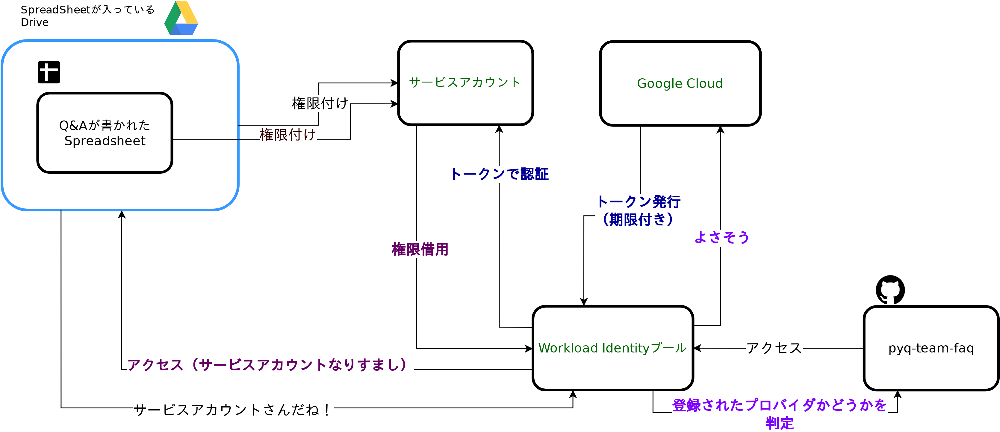

---
* なんか安全そう（小並感）
* 権限の所在が後で見ても解りやすそう
* どうせ認証情報は作り直しだし…
* これを機に移行するか〜
---

# 🏃💨 移行していく

---

## ☝️ 手順

1. サービスアカウントの作成
1. アクセス権限付与
1. リソース（今回はSheetsとDrive）にサービスアカウントを招待
1. Workload Identityプール プロバイダ追加
1. プロバイダにサービスアカウントを接続
1. 認証用スクリプト書き換え

---

## 1️⃣ サービスアカウントの作成

IAMと管理 > サービスアカウント > サービスアカウントを作成
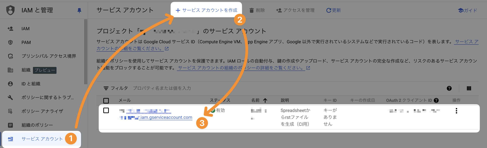

---

## 2️⃣ アクセス権限付与

IAMと管理 > IAM > 編集アイコン > ロール「参照者」

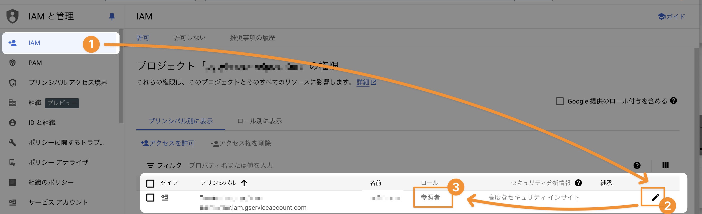


※サービスアカウント作成時に付与することも可能

---

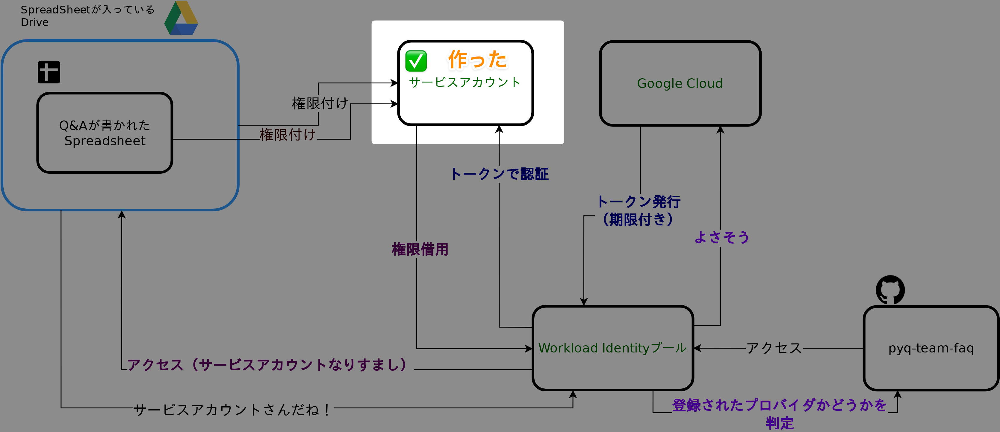

---

## 3️⃣ Google Cloudリソース（今回はSheetsとDrive）にサービスアカウントを招待

権限は閲覧者でOK


---

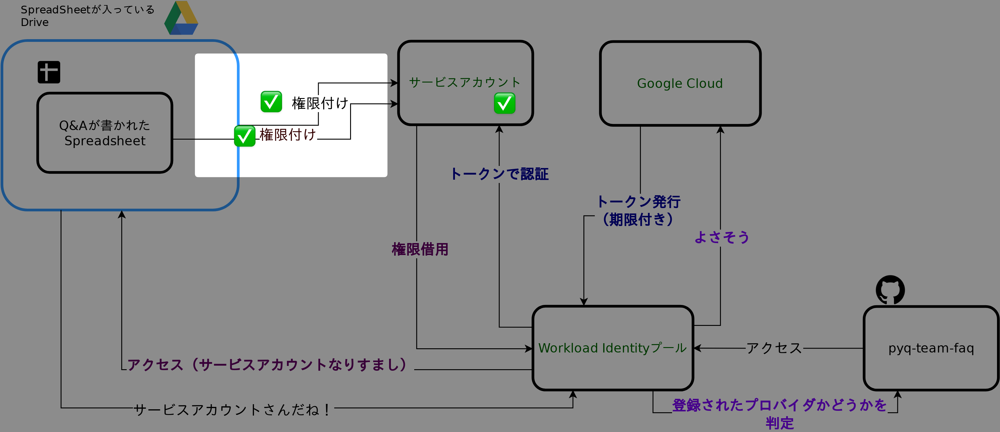

---

## 4️⃣ Workload Identityプール プロバイダ追加


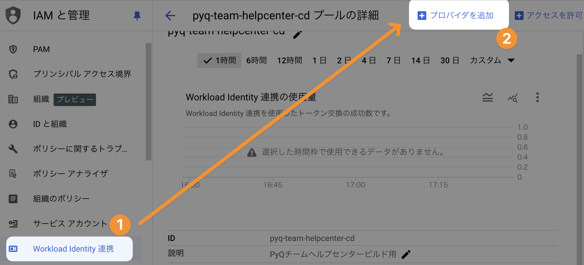
※ プロバイダが1つもない場合別の画面が出る（気がする）

---

## 4️⃣ Workload Identityプール プロバイダ追加: 設定項目

|項目|値|
| --- | --- |
| プロバイダの選択 | OpenID Connect（OIDC） |
| プロバイダ名 | 任意（表示用） |
| プロバイダID | 任意（外部IDの一部になる） |
| 発行元URL | https://token.actions.githubusercontent.com |
| JWK ファイル（JSON） | 不要 |
| オーディエンス | デフォルトのオーディエンス |
| 属性のマッピング - google1 | google.subject（トークンの種類によって固定？） |
| 属性のマッピング - OIDC 1 | assertion.repository |
|属性条件 - 属性CEL| `assertion.repository == '<組織>/<リポジトリ名>'`|

---

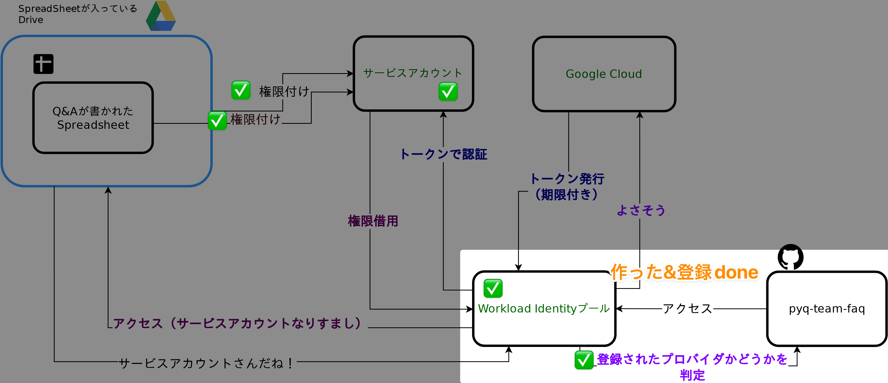

---

## 5️⃣ プロバイダにサービスアカウントを接続
作成したプロバイダのプリンシパルを控えておきます
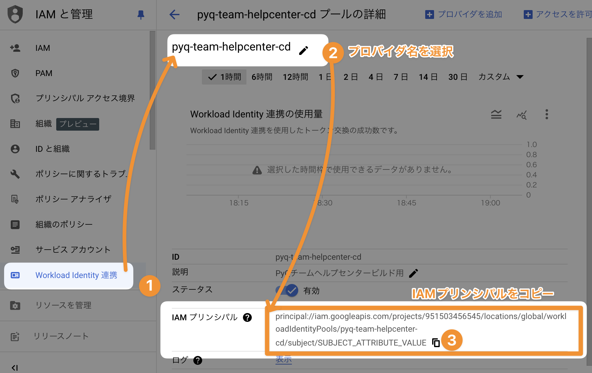

---

### プリンシパルの構成

```
principal://iam.googleapis.com/projects/[プロジェクト番号]
/locations/globalworkloadIdentityPools/[プロバイダID]
/subject/**SUBJECT_ATTRIBUTE_VALUE**
```

* SUBJECT_ATTRIBUTE_VALUEは、属性条件で入力した値に書き換える
* 今回は属性マッピングがassertion.repositoryだったので、属性CELで指定したGitHubのリポジトリ名に書き換え（今回は`beproud/pyq-team-faq`）

---

### サービスアカウントにプリンシパル追加
サービスアカウント > 作ったサービスアカウント > 権限タブ > アクセスを許可

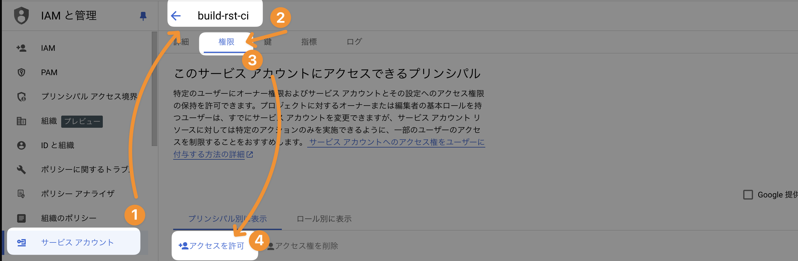

---

### サービスアカウントにプリンシパル追加-設定
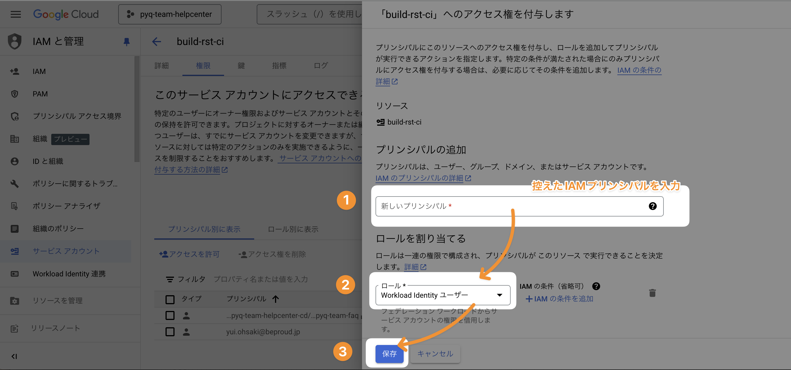

---

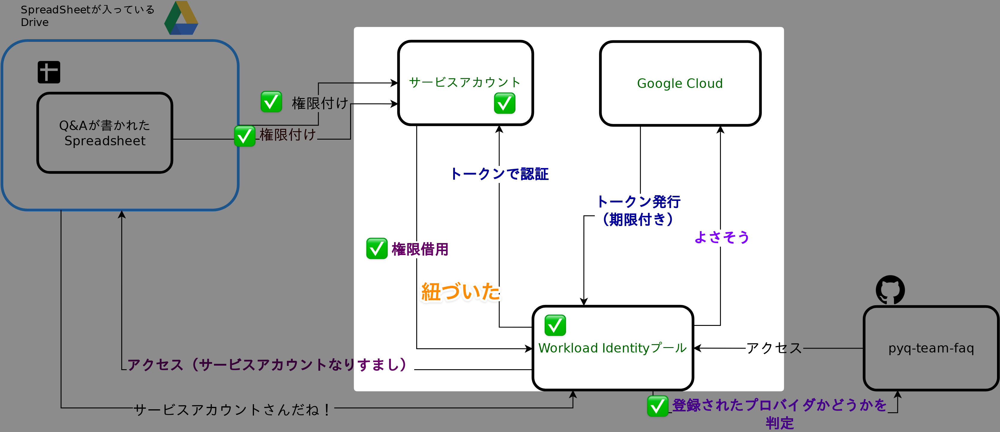

---

## 6️⃣ （やっと）GitHub Actions YAML追記 / fetch用スクリプト変更

### YAML追記

```diff
+      - uses: google-github-actions/auth@v1
+        with:
+          workload_identity_provider: '<IAMプリンシパル>'
+          service_account: '<サービスアカウント名>'
```

### YAML変更（トークンファイルの定義を削除)

```diff
       - name: Update the FAQ
         run: |
           pandoc --version
           python scripts/generate_articles.py fetch \
-           --token-file=<(echo '${{ secrets.GOOGLE_TOKEN }}') \
             --spreadsheet-id=${{ github.event.inputs.spreadsheet_id }}
           python scripts/generate_articles.py generate-rst
```

---

### script

```diff
- def main_authz(args) -> int:
-     flow = InstalledAppFlow.from_client_secrets_file(
-         args.credentials_json,
-         SCOPES,
-     )
-     creds = flow.run_console()
-     args.token_file.write(creds.to_json())
-     return 0

+ def get_credentials():
+     creds, _ = default()
+     return creds

def main_fetch(args):
+   creds = get_credentials()
-   creds = Credentials.from_authorized_user_file(args.token_file)
```
🍊.o(別に関数名変えなくてよかったような）

---

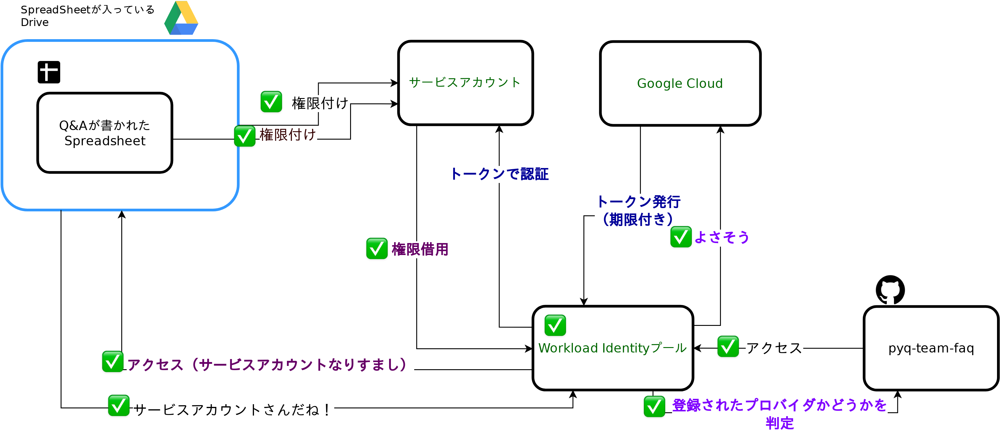

---

# ✨️ お疲れさまでした


---

# 😢 と思ったらエラーでた

```
Error: google-github-actions/auth failed with: 
retry function failed after 4 attempts: gitHub Actions did not inject 
$ACTIONS_ID_TOKEN_REQUEST_TOKEN or $ACTIONS_ID_TOKEN_REQUEST_URL into this job.
 This most likely means the GitHub Actions workflow permissions are incorrect, 
 or this job is being run from a fork. 
 For more information, please see 
 https://docs.github.com/en/actions/security-guides/automatic-token-authentication#permissions-for-the-github_token
```

forkはしてないしなあ…

>workflow permissions are incorrect

これかな？

---

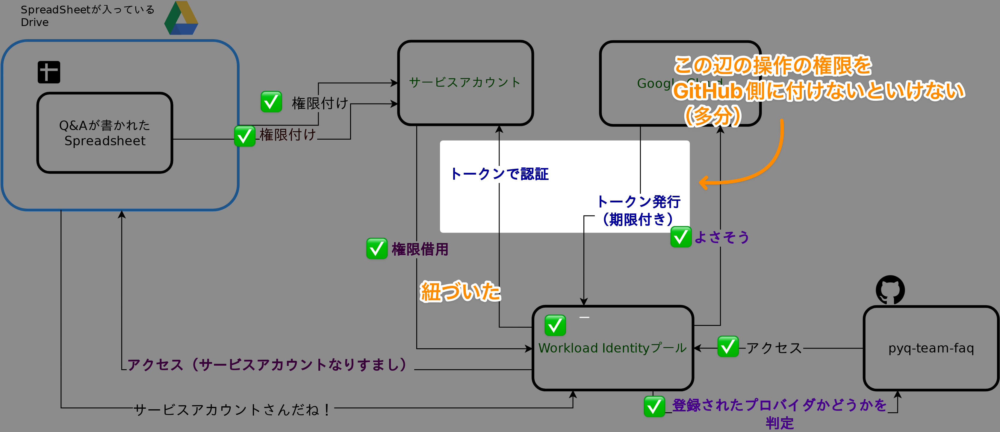

---

## ☔ 引っかかりポイント

* id-tokenのpermissionsのデフォルトはnoneなので、Actionsで明示しないといけない
* [GitHub Actionsのドキュメント](https://docs.github.com/ja/actions/security-for-github-actions/security-hardening-your-deployments/configuring-openid-connect-in-google-cloud-platform#adding-permissions-settings)にめっちゃ書いてましたね…
* 行ったり来たりするので手順見失いがち
* yamlに以下を追加して動いた🎉

```diff
+ permissions:
+  id-token: write
+  contents: read
```
---

# ㊗️ （こんどこそ）お疲れさまでした


---


---
# 💬 感想
* やることが…多い…！！！！！！！！
  * とはいえ新規導入の場合は粛々とドキュメントに沿ってやれば簡単だと思います
* GitHubやAWSなどの外部ワークロード専用の認証方法なので、最終成果物はかなり解りやすくなっている
  * GCPのコンソールの画面だけで、付与されている権限が確認できる
  * GitHub Actionsのyamlやスクリプトもスッキリ
* 今回実際に、移行前のサービスアカウントの認証キーの権限が所在不明になっていたので、安全性の担保のしやすさ的なものを実感
---
# 📚️ 参考
* Google API OAth認証関連
  * [Sheets API Python クイックスタート](https://developers.google.com/sheets/api/quickstart/python)
  * [OAuth 2.0 を使用して Google API にアクセスする](https://developers.google.com/identity/protocols/oauth2?hl=ja)
* Workload Identifyとはなんぞや
  * [Workload Identity 連携](https://cloud.google.com/iam/docs/workload-identity-federation?hl=ja)
  * [見て見ぬふりをしない、権限とWorkload Identity(Google Cloud)](https://zenn.dev/kamos/articles/92a8125dc3adac)
* GitHub ActionsとWorkload Identify連携
  * [Google Cloud Platform での OpenID Connect の構成](https://docs.github.com/ja/actions/security-for-github-actions/security-hardening-your-deployments/configuring-openid-connect-in-google-cloud-platform)
  * [デプロイメント パイプラインとの Workload Identity 連携を構成する](https://cloud.google.com/iam/docs/workload-identity-federation-with-deployment-pipelines?hl=ja)
---
# 🙇‍♀️ ご清聴有難うございました
