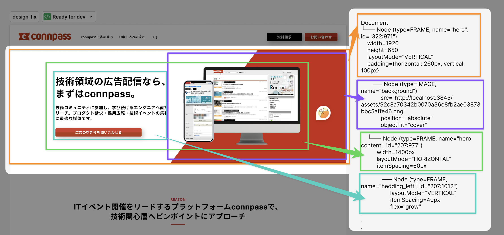
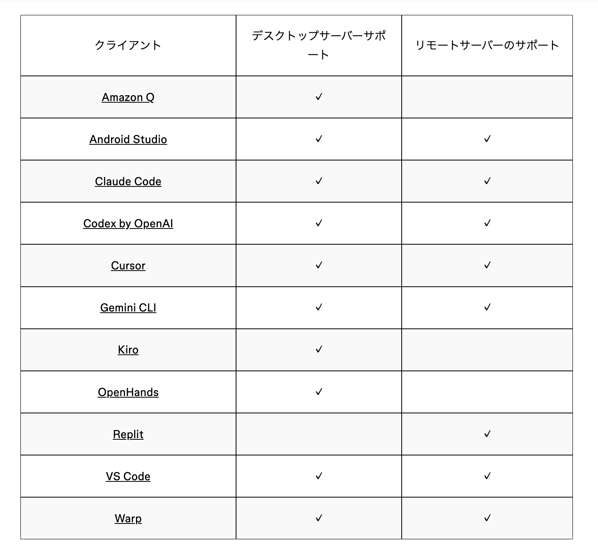
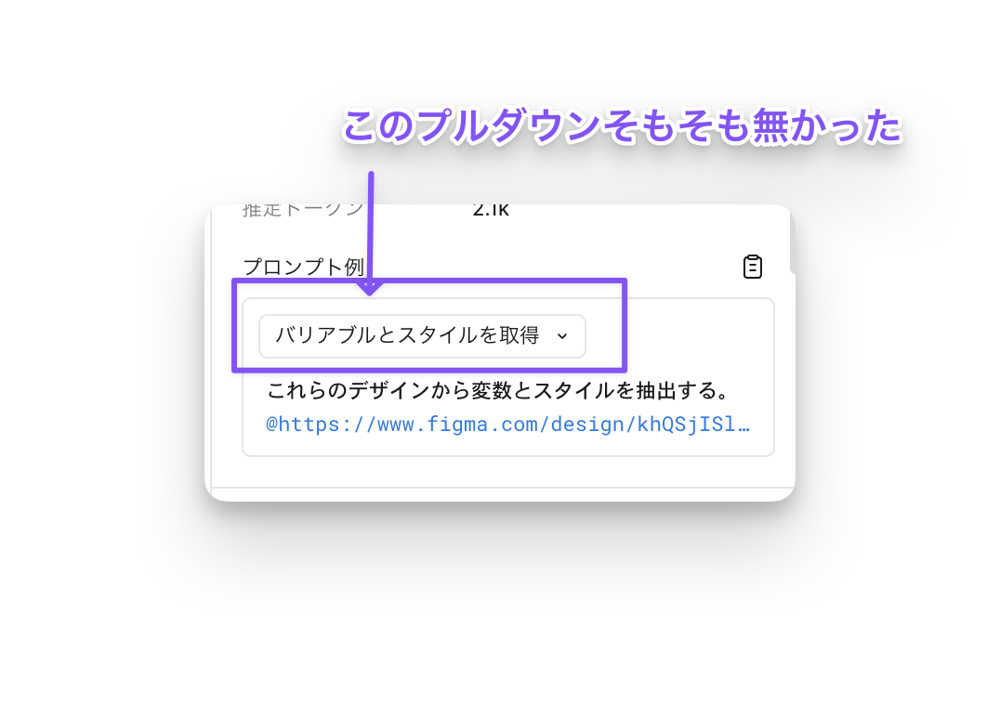
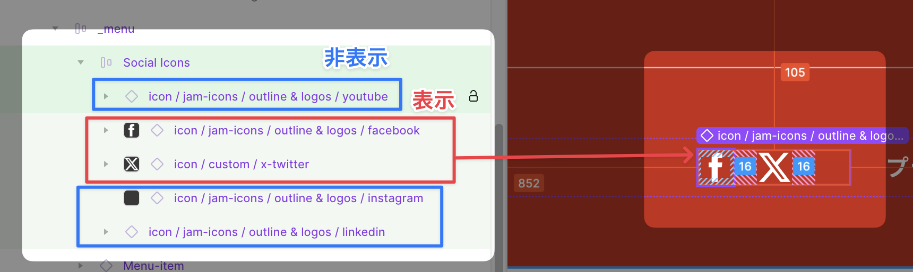
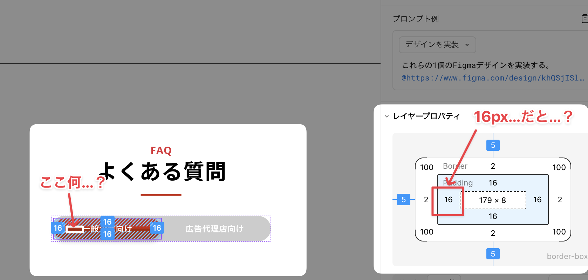
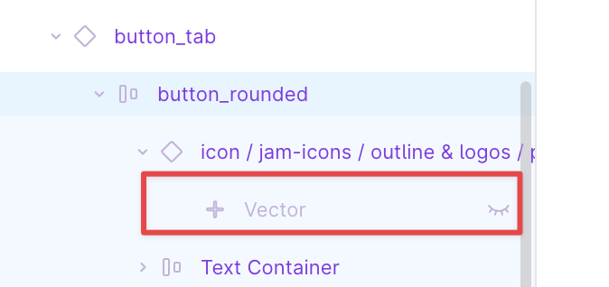

<!-- _class: lead -->
# Figma MCP×ClaudeでLP実装爆速化した話

nana / BP Style#180


---

# 今日の話

マーケチームで  
**Figma + Claude Code + Figma MCP** を使って  
静的ページの実装プロセスを検証した話です。


---

# 話すこと

* フロント実装全般に使える、FigmaMCP活用ファーストステップ
* 実際にやってみた、気をつけること
  * 実装視点
  * デザイナー視点
* Demoまでで時間切れの予感しかしていません

---

# 話さないこと

* チーム開発全体の効率化
* より大規模な自動化
* 手元で気軽に導入できる範囲のため、基本的には見張っている前提
* 更に放置したい場合は自立型エージェントへの組み込みとかを調べてね

---

# マーケチームの前提

- マーケ用 LP（ランディングページ/1枚ものの静的サイト） は内製
- HTML / CSS / 少しのJSは全員書ける
- Figmaデザインは２人できる

---

# マーケLP制作の前提

- LPを月1本ペースで制作
- ページの構造はほぼ同じだが、デザインテーマと中身が異なる
- Figmaでの作業は、デザインデータをコンポーネント化して効率化
- 実装は毎回ほぼ0から

---

# 問題意識

> 「構造もスタイルもFigmaにあるのに、  
> なぜ毎回似たようなHTMLを人が書いているんだろう？」

---

# 立てた仮説

> **ClaudeがFigmaの構造を  
> 正しく読めるなら、  
> HTML/CSSの大部分は肩代わりできるのでは？**

---

# 試したこと

* Figma MCP でデザイン構造を取得
* Claude Code に渡す
* HTML / SCSS をベースに出力させる
  * （必要に応じてCSS/JSライブラリも利用）

---

# なんとか（ry


---

# 結果

- 対象: [connpass純広告LP](https://business.connpass.com/display_ad/)
- 静的部分の約90%を生成
- 約3日→3hに
- 人はどうせ人間が最終確認する箇所&リッチな表現に集中できた


この検証結果を共有します。

---

<!-- _class: invert -->
# なぜそれが可能だったのか

---

# AIが実務レベルでデザインを再現する為に必要なこと

* AIが入力元 / 出力先にスムーズにアクセスできる
  * = MCPがある
* AIにとってデザインデータが「意味」を読み取れる形である
  * = 構造化されたデータ
  * まだAIは画像から構造を厳密に読み取る事は苦手

---

# Figma = デジタルデザイン用ツールの独自性

Photoshopなどのデザイン = **ピクセルの集合**  
Figmaのデザイン = **UIの構造**

---

# もともと、Figmaのデザインデータはテキストで表示できる

```
type=FRAME
layoutMode=VERTICAL
padding=24
styles.text=Body/Small
```
→ コンピューターが読めるデータ

---



---

# figmaMCPがしたこと

Figmaの  
**UI構造ツリー** を  
そのまま AI に渡せるようにしただけ

---

# Claudeは何を読んでいるか

Claudeはデザインデータの
**見た目（画像）ではなくUIの構造** を読んでいる

→ 構造 = AIにとっての「UIの意味」

---

# だから（普通に）実装できる

* 要するにClaude（などのエディタ）の世界に引き込めば勝ちということ

---

<!-- _class: invert -->
# 導入手順とデモ

---

# FigmaMCPを使うためのFigmaプラン

* devシートかfullシート
* devモードが使えればOK

---

# 任意のエディタにFigma MCPを追加

* [ドキュメント](https://help.figma.com/hc/ja/articles/32132100833559-Figma-MCP%E3%82%B5%E3%83%BC%E3%83%90%E3%83%BC%E3%81%AE%E3%82%AC%E3%82%A4%E3%83%89#h_01K25F7RBTYYHG2M8MQ64BF5N0)


---

# 対応エディタ



* ドキュメントから各エディタ向けの導入詳細に飛べて親切☺️
* 今回はClaude Codeを使います

---

# おすすめ構成

* 手元でミニマム導入の場合、デスクトップアプリ×ローカルMCPがおすすめ
* アプリでぽちぽち選択→ノードを取得できるので手軽

---


---

# Demo

* 1セクション実装してみる
* 無事動くといいな…

---

<!-- _class: invert -->
# いい感じに実装するためのTips
## 時間があったら紹介します…

---

# 効率的に実装できる（可能性が高まる）tips

1. プロジェクト構造を先に用意しよう
2. スタイル変数を先に定義しておこう
3. 空気読み実装に目を光らせよう
4. 見た目上のスタイルに注意
5. 静的ファイル操作は自分でやる

---

# Tip①
## プロジェクト構造を先に用意しよう

* （やっていることがスタイルとDOM構造を読み取るだけなので）フロントの構成はなんでもOK
* JSXでもhtmxでも
* bootstrapでもtailwindでもMaterializeでもUIkitでも
* マーケLPは `11ty（+Vite） + Nunjucks + UIkit` とかいう大分ニッチな感じ
* →全然いけた
* **とにかくリポジトリで定義しておけ**

---

## 具体的に

* **package.jsonを書こう**
* ビルド元の定義ファイルに使うライブラリをインストールしておこう
* scss別読み込みの場合はscssのimport構造を作っておこう

→ Claudeはこの構造に沿ってコードを書く

---

# Tip②
## スタイル変数を先に定義しておこう

* 共通のスタイル変数をFigmaと同じに定義しておくと勝手に参照してくれる
* 定義がスマートに行くかはデザインデータ次第

---

## どゆこと？

* Figmaには変数を定義するときに参照するであろう機能が2つある（歴史的経緯）
  * スタイル → エクスポートにはプラグインが必要
  * バリアブル → devモードの拡充で増えた エクスポートできる
* 色情報とかはバリアブルに入れておくといいが、デザイナーは（楽なので）スタイルで定義しがち
* スタイルとバリアブルが混ざっていると、考える事が多い
  * 手作業エクスポートが早いかプロンプトをこねるが早いかはケースバイケースかなあ...

---

## と思ったらなんか増えてた



---

* ええやん
* 発表当日気付いたので未検証
* いい感じにできたら教えてください

---

# Tip③
## 空気読み実装に目を光らせよう

* ここまでFigmaMCPは構造を送ると言っていたのですが、実はSS（スクリーンショット）も一緒に渡しています
* メタデータ（ツリー構造） + SS
* 偶にメタデータ読み込みがエラーになる時がある
* ↑でSSが読み込めた場合、（Claude Codeの場合）SSベースでいい感じにやろうとします
* そして架空のLPを錬成
* やめて

---

## どうすれば

* エラーは出ているはずなので止めてください…笑
* データが大きくなってくるとエラーが出やすいので、細切れに実装するが吉
  * コンポーネントが共通化されている場合、粒度小→大と実装していけばデータ量は少なくなるので、最終的に1画面全体を選択して送信してもいけそう（※肌感）

---

# Tip④
## 見た目上のスタイルに注意

* Figma上で、稀に対象の構造に含まれない見た目上のスタイルが適用されることがあります
* その場合高確率で構造通りに実装され、見た目が一致しなくなります
* 主に要素の非表示に注意

---

## 具体例①

* レイヤーの非表示で作られたVariant

---

### これが



---

### AIにはこれに見えている


---

## 具体例②

* 非表示により生まれた余白

---

### 君の名は



---

### 非表示コンポーネント



---

# Tip⑤
## 静的ファイル操作は自分でやる

* 静的アセット=主に画像
* Figma側でエクスポートをきっちり設定してあればいけるかもしれないが…
* やりとりするデータも増えるので効率化観点では微妙
* （そのうちfigmaMCPも有料化しそうだし）


---

## 画像配置で実際にやった手順

* 実装したコードの画像参照先の命名規則を指定🤖
* 画像はダミー画像を生成しておく🤖
* Figmaから画像エクスポート✋️
* リネームしてimagesのフォルダに配置✋️

---

<!-- _class: invert -->
# まとめ

---

# figmaMCPで起きた変化

Figmaは  
**「完成図」ではなく  
「実装用の入力データ」** になった

---

# 実装で気をつけること

* 環境構築が先
* 見た目が違う時は非表示コンポーネントを疑え
* スクリーンショットだけでは無理

---

# デザインデータ作成で気をつけること

* コンポーネントのVariantを作る場合レイヤー非表示はやめとけ
* スタイルとバリアントは綺麗にしておこう
* コンポーネントは綺麗にしておこう

---

# Thank you


---
